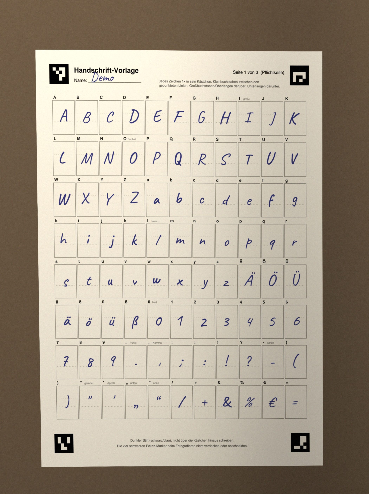
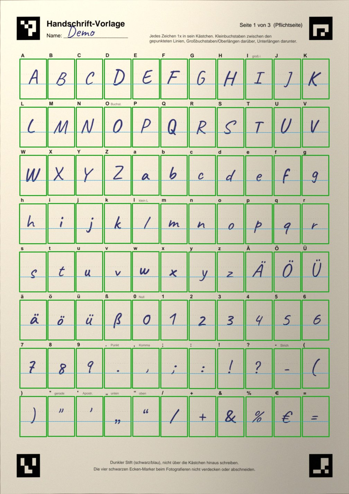
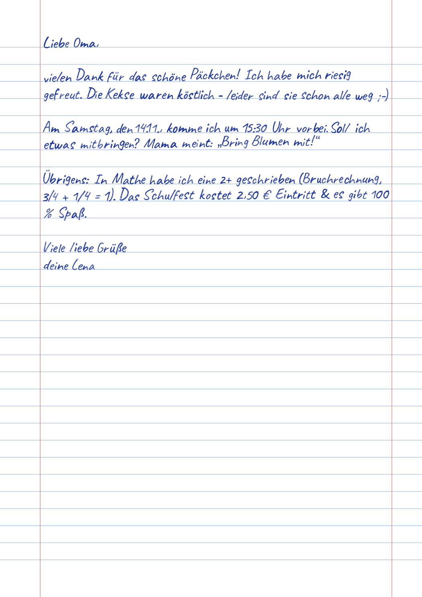

# ✍️ Handschrift-Generator

Lernt **deine Handschrift** aus einem Foto eines ausgefüllten Templates und schreibt danach
beliebig viele Texte in dieser Handschrift auf **liniertes DIN-A4-Papier als PDF**.
Mehrere Nutzer (du und deine Freunde) haben jeweils ihr eigenes Profil.

| Ausgefülltes Template (Foto) | Kontrollbild nach dem Training | Ergebnis als PDF |
|---|---|---|
|  |  |  |

> Die Beispiele oben nutzen eine *simulierte* Handschrift (Demo-Nutzer). Mit deinem
> eigenen Foto sieht das Ergebnis aus wie deine Schrift.

---

## Inhalt

1. [Installation](#installation)
2. [Schnellstart: Overnight-Build](#schnellstart-overnight-build)
3. [Schritt für Schritt zur eigenen Handschrift](#schritt-für-schritt-zur-eigenen-handschrift)
4. [Freunde hinzufügen](#freunde-hinzufügen)
5. [Alle Befehle](#alle-befehle)
6. [Projektstruktur](#projektstruktur)
7. [So funktioniert es](#so-funktioniert-es)
8. [Tipps & Fehlerbehebung](#tipps--fehlerbehebung)

---

## Installation

Voraussetzung: **Python 3.9 oder neuer** (getestet mit 3.13), Windows, macOS oder Linux.

Am einfachsten über das Overnight-Skript (legt automatisch eine virtuelle Umgebung `.venv` an
und installiert alles, siehe unten). Manuell geht es so:

```bash
python3 -m venv .venv
source .venv/bin/activate          # Windows: .venv\Scripts\activate
pip install -r requirements.txt
```

Benötigte Pakete (`requirements.txt`): `numpy`, `opencv-python-headless` (Bildverarbeitung +
ArUco-Marker), `Pillow`, `reportlab` (PDF), `fonttools` (TTF-Export), `pypdfium2` (PDF-Scans
einlesen, Vorschaubilder), `pytest` (Tests). Optional für iPhone-HEIC-Fotos: `pillow-heif`.

## Schnellstart: Overnight-Build

Ein einziger Befehl richtet alles ein und testet es, ganz ohne Rückfragen:

```bash
./overnight.sh            # macOS / Linux
overnight.bat             # Windows (in der Eingabeaufforderung im Projektordner)
```

Das Skript:

1. legt `.venv` an und installiert die Pakete,
2. erzeugt das Ausfüll-Template `templates/handschrift_vorlage.pdf`,
3. legt zwei Demo-Nutzer an (`demo`, `demo2`), füllt das Template mit einer simulierten
   Handschrift aus und macht daraus ein realistisches „Handyfoto“ (schräg, ungleichmäßiges
   Licht, leicht gewölbtes Papier, Rauschen …),
4. trainiert beide Demo-Nutzer mit diesen Fotos und prüft, dass jedes Zeichen aus dem
   richtigen Kästchen kam,
5. erzeugt Beispiel-PDFs (Brief, Gedicht über 2 Seiten, Einkaufsliste auf kariertem Papier)
   und exportiert die Handschriften zusätzlich als `.ttf`-Schrift,
6. macht einen Stabilitätstest (viele zufällige Texte, Papiere, Farben, Größen),
7. führt die automatischen Tests (`pytest`) aus,
8. schreibt einen Bericht nach `logs/overnight_report.md` und kopiert die Ergebnisse nach `examples/`.

Ein normaler Lauf dauert nur **ca. 2–3 Minuten**. Wer die Nacht wirklich nutzen will, kann
den Stabilitätstest verlängern, z. B. `./overnight.sh --stress 5000` (läuft dann Stunden).

Nach dem Lauf findest du:

| Datei | Inhalt |
|---|---|
| `templates/handschrift_vorlage.pdf` | **leeres Template zum Ausdrucken** (3 Seiten) |
| `templates/ANLEITUNG.txt` | Anleitung: ausfüllen & fotografieren |
| `examples/beispiel_vorlage_ausgefuellt.pdf` | so sieht ein ausgefülltes Template aus |
| `examples/ausgabe/*.pdf` + `*.png` | Beispiel-PDFs in Demo-Handschrift + Vorschaubilder |
| `examples/beispiel_glyph_uebersicht.png` | alle gelernten Zeichen des Demo-Nutzers |
| `logs/overnight_report.md` | Bericht: was lief, was (nicht) geklappt hat |
| `logs/overnight_*.log`, `logs/handschrift.log` | ausführliche Logs |

## Schritt für Schritt zur eigenen Handschrift

### 1) Template ausdrucken und ausfüllen

```bash
python main.py template          # (erzeugt templates/handschrift_vorlage.pdf neu – optional)
```

* `templates/handschrift_vorlage.pdf` auf A4 ausdrucken (Farbe oder S/W egal).
* **Seite 1 ist Pflicht**, Seite 2 und 3 sind optional: Sie enthalten dieselben Zeichen nochmal.
  Jede weitere Seite = eine weitere Variante pro Buchstabe → der Text sieht natürlicher aus.
* Mit **dunklem Stift** (schwarzer/blauer Kuli, Fineliner) in jedes Kästchen das Zeichen
  schreiben, das darüber steht. Kleinbuchstaben zwischen die gepunkteten Linien, alles sitzt
  auf der unteren Linie; Großbuchstaben/Oberlängen darüber, Unterlängen (g, j, p, q, y) darunter.
* Nicht über den Kästchenrand schreiben, die schwarzen Ecken-Quadrate frei lassen.

Ausführlich: [`templates/ANLEITUNG.txt`](templates/ANLEITUNG.txt)

Enthaltene Zeichen (88): `A–Z`, `a–z`, `Ä Ö Ü ä ö ü ß`, `0–9`, `. , ; : ! ? - ( ) " ' „ “ / + & % € =`

### 2) Foto oder Scan machen

* Scanner (300 dpi) ist ideal; ein Handyfoto geht genauso.
* Blatt flach hinlegen, von oben fotografieren, **alle vier Ecken-Quadrate müssen drauf sein**.
  Schräge Fotos, Drehung (auch kopfüber) und ungleichmäßiges Licht gleicht die App aus.
* Formate: JPG, PNG, TIFF, BMP, WEBP, **PDF** (auch mehrseitige Scans), HEIC (mit `pillow-heif`).

### 3) Nutzer anlegen und Training starten

```bash
python main.py user add vincent --display-name "Vincent"
# Foto(s) nach users/vincent/input/ kopieren, dann:
python main.py train --user vincent
# oder direkt mit Dateiangabe:
python main.py train --user vincent --input sample_vincent.jpg
python main.py train --user vincent --input seite1.jpg seite2.jpg seite3.jpg
```

(`train` legt den Nutzer auch automatisch an, falls es ihn noch nicht gibt.)

Danach unbedingt kurz die **Kontrollbilder** ansehen:

* `users/vincent/handwriting/glyph_uebersicht.png` – alle gelernten Zeichen mit Grundlinie
* `users/vincent/handwriting/debug/*.jpg` – entzerrte Seite; grün = Zeichen erkannt, rot = Kästchen leer

Ein Zeichen missraten? Seite neu ausfüllen, fotografieren und erneut trainieren.
Mit `--append` kommen neue Fotos **zusätzlich** zu den bisherigen Varianten hinzu.

### 4) Texte rendern – so oft du willst

```bash
python main.py render --user vincent --input text.txt --output output.pdf
python main.py render --user vincent --text "Hallo Welt\nZweite Zeile"
python main.py render --user vincent --input brief.txt --paper kariert --ink schwarz --preview
```

* Ein reiner Dateiname bei `--output` landet in `users/vincent/output/`; ohne `--output`
  wird ein Name mit Zeitstempel gewählt.
* Lange Texte werden automatisch umgebrochen und auf mehrere Seiten verteilt; Leerzeilen
  bleiben erhalten; überlange Wörter werden getrennt.
* Ränder: 2 cm links, 1,5 cm rechts/oben/unten (rote Randlinien wie im Schulheft).
* Jeder Aufruf sieht leicht anders aus (natürliche Variation). Mit `--seed 42` wird das
  Ergebnis reproduzierbar.

Optionen von `render`:

| Option | Bedeutung | Standard |
|---|---|---|
| `--paper` | `liniert`, `kariert` oder `blanko` | `liniert` |
| `--line-spacing` | Zeilenabstand in mm | 8.5 (kariert: 10) |
| `--ink` | `blau`, `dunkelblau`, `koenigsblau`, `schwarz`, `rot`, `gruen` oder `#RRGGBB` | `blau` |
| `--size` | Schriftgröße-Faktor | 1.0 |
| `--jitter` | Natürlichkeit: 0 = exakt, 1 = normal, 2 = unordentlich | 1.0 |
| `--seed` | Zufallswert für reproduzierbare Ergebnisse | zufällig |
| `--no-margin` | keine roten Randlinien | – |
| `--preview` | zusätzlich PNG-Vorschau je Seite | – |

Persönliche Standardwerte speichern: `python main.py user set vincent --ink schwarz --paper kariert --size 1.1`

**Bonus:** `python main.py export-font --user vincent` erzeugt `users/vincent/handwriting/handschrift_vincent.ttf`
– deine Handschrift als Schriftart für Word, LibreOffice & Co.

## Freunde hinzufügen

Jeder Freund bekommt sein eigenes Profil – die Handschriften stören sich nicht gegenseitig:

```bash
python main.py user add freund1 --display-name "Max"
# Max druckt das Template aus, füllt es aus, schickt dir das Foto
python main.py train  --user freund1 --input max_foto.jpg
python main.py render --user freund1 --input text.txt --output fuer_max.pdf
python main.py user list
```

Alternativ klonen/kopieren Freunde das ganze Projekt und machen dasselbe bei sich.
Die Daten eines Nutzers liegen komplett in `users/<name>/` – zum Weitergeben oder Sichern
einfach diesen Ordner kopieren. Löschen: `python main.py user remove freund1 --yes`.

> `users/` ist in `.gitignore` eingetragen, damit persönliche Handschriften nicht
> versehentlich in ein Git-Repository hochgeladen werden.

## Alle Befehle

```text
python main.py template [--pages 3] [--output datei.pdf]
python main.py user add <name> [--display-name "..."]
python main.py user list
python main.py user show <name>
python main.py user set <name> [--ink ...] [--paper ...] [--size ...] [--display-name ...]
python main.py user remove <name> --yes
python main.py train --user <name> [--input bild/pdf/ordner ...] [--append]
python main.py render --user <name> (--input text.txt | --text "...") [--output x.pdf] [Optionen]
python main.py export-font --user <name> [--output x.ttf]
python main.py overnight [--stress 25] [--skip-tests]
python main.py --help        # Hilfe, auch für jeden Befehl: python main.py render --help
```

## Projektstruktur

```text
Handschrift/
├── main.py                  zentraler Einstiegspunkt (Subcommands)
├── overnight.sh / .bat      Ein-Befehl-Erstlauf (venv + Pakete + Build + Tests)
├── requirements.txt
├── src/handschrift/
│   ├── cli.py               Kommandozeile
│   ├── config.py            Pfade & Konstanten
│   ├── charset.py           Zeichensatz, Text-Normalisierung, Ersatzzeichen
│   ├── layout.py            Geometrie des Templates (gemeinsam für Zeichnen & Einlesen)
│   ├── template.py          Template-PDF erzeugen (ArUco-Marker, Kästchen, Hilfslinien)
│   ├── imageio.py           Fotos/Scans/PDFs laden (inkl. EXIF-Drehung)
│   ├── train.py             Marker finden, entzerren, Zeichen ausschneiden, speichern
│   ├── glyphs.py            gespeicherte Handschrift laden + Kontrollbild
│   ├── paper.py             liniertes / kariertes / leeres A4-Papier
│   ├── render.py            Text setzen (Umbruch, Abstände, Variation) → PDF
│   ├── fontexport.py        Export als TrueType-Schrift
│   ├── users.py             Nutzerprofile anlegen, laden, speichern
│   ├── simulate.py          simulierte Handschrift + Handyfoto (Demo & Tests)
│   ├── overnight.py         der Overnight-Build
│   └── logsetup.py          Logging (Konsole + logs/)
├── templates/               Template-PDF, Vorschau, ANLEITUNG.txt
├── users/                   ein Ordner pro Nutzer (input/, handwriting/, output/)
├── examples/                Beispieltexte, Beispiel-PDFs, Bericht des letzten Overnight-Laufs
├── assets/fonts/            zwei freie Handschrift-Fonts (OFL) nur für die Demo-Nutzer
├── tests/                   automatische Tests (pytest)
└── logs/                    Log-Dateien und Berichte
```

## So funktioniert es

**Template:** Jede Seite hat vier ArUco-Marker in den Ecken (jede Seite eigene IDs) und ein
Raster aus 88 Kästchen mit gepunkteter Grundlinie und x-Höhen-Linie. Dieselbe Geometrie-Datei
(`layout.py`) wird zum Zeichnen *und* zum Einlesen verwendet.

**Training (`train.py`):**
1. Marker im Foto finden → Seite erkennen und Perspektive berechnen (Homographie aus 16 Eckpunkten).
2. Seite auf 12 Pixel/mm entzerren, Beleuchtung ausgleichen (Teilen durch geschätzte Papierhelligkeit).
3. Jedes Kästchen am gedruckten Rahmen „einrasten“ (gleicht gewölbtes Papier aus).
4. Tinte vom Papier trennen; Reste von Rahmen und gepunkteten Hilfslinien werden verworfen.
5. Jedes Zeichen als Graustufen-Alphabild speichern (Strichstärke und Stiftstruktur bleiben
   erhalten) – mit Grundlinie, Größe und Herkunft in `glyphs.json`.
6. Grundlinien werden pro Zeichen aus der Tinte bestimmt (a, b, c … sitzen genau auf der Zeile,
   g, j, p … hängen darunter) und die typische x-Höhe/Großbuchstabenhöhe gemessen.

**Rendern (`render.py`):**
* Schriftgröße so, dass x-Höhe ≈ 2,9 mm und Großbuchstaben genug Platz zur Zeile darüber lassen.
* **Optischer Buchstabenabstand:** statt Kästchen nebeneinanderzusetzen, rückt jeder Buchstabe
  so nah an den vorherigen, wie es seine tatsächliche Form erlaubt – wie beim echten Schreiben.
* Natürliche Variation: zufällige Variante pro Buchstabe (bei mehreren Template-Seiten; nie zweimal
  dieselbe direkt hintereinander), leichte Drehung, Größe, Grundlinien-Schwankung, Zeilenneigung,
  Wortabstände und Tintendeckung.
* Fehlende Zeichen werden ersetzt (é → e, “ → ", – → -) oder ausgelassen und gemeldet.
* Glyphen werden als Bilder ins PDF eingebettet (jede Variante nur einmal) – Papierlinien bleiben Vektoren.

## Tipps & Fehlerbehebung

| Problem | Lösung |
|---|---|
| „Nur 2 von 4 Ecken-Markern erkannt“ | ganzes Blatt fotografieren, Marker nicht abschneiden/verdecken, schärfer und heller fotografieren |
| Zeichen fehlen (rot im Kontrollbild) | zu heller Stift oder Kästchen leer → dunkleren Stift nehmen, Seite neu ausfüllen |
| Buchstabe sieht abgeschnitten aus | über den Kästchenrand geschrieben → etwas kleiner schreiben |
| Text wirkt zu groß/klein | `--size 0.9` bzw. `--size 1.2` (oder dauerhaft per `user set`) |
| Text wirkt zu gleichmäßig | 2–3 Template-Seiten ausfüllen (mehr Varianten), ggf. `--jitter 1.3` |
| HEIC-Fehler (iPhone) | `pip install pillow-heif` oder Kamera auf „Maximale Kompatibilität“ |
| Was ist passiert? | `logs/handschrift.log` bzw. `logs/overnight_report.md` |

**Grenzen:** Die Zeichen werden einzeln gesetzt. Druckschrift funktioniert dadurch sehr gut;
eine *verbundene* Schreibschrift wird nachgeahmt, aber die Verbindungsstriche zwischen den
Buchstaben fehlen.

## Tests

```bash
python -m pytest -q
```

Die Tests simulieren ausgefüllte und fotografierte Templates (auch kopfüber), prüfen, dass jedes
Zeichen aus dem richtigen Kästchen kommt, und testen Umbruch, Ränder, Mehrseitigkeit, Papierarten,
Farben, Font-Export, Nutzerverwaltung und die Kommandozeile.

## Lizenz der Demo-Schriften

`assets/fonts/` enthält *Caveat* und *Patrick Hand* (SIL Open Font License 1.1, siehe
`assets/fonts/README.md`). Sie werden nur für die simulierten Demo-Nutzer verwendet.
